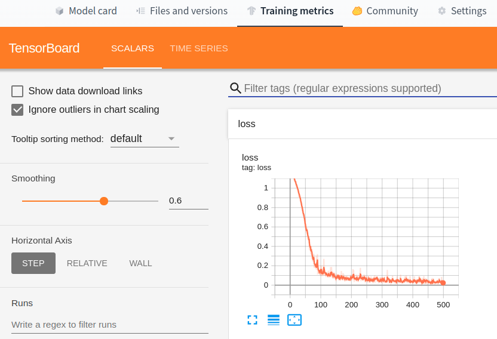
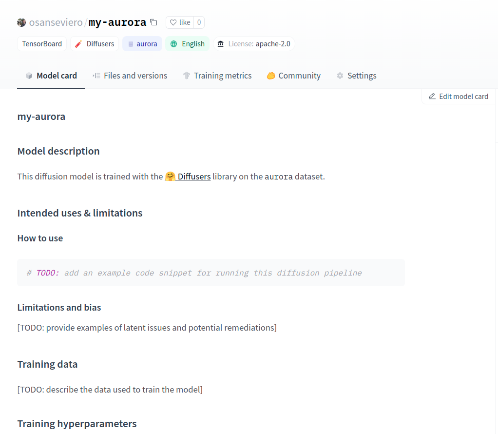
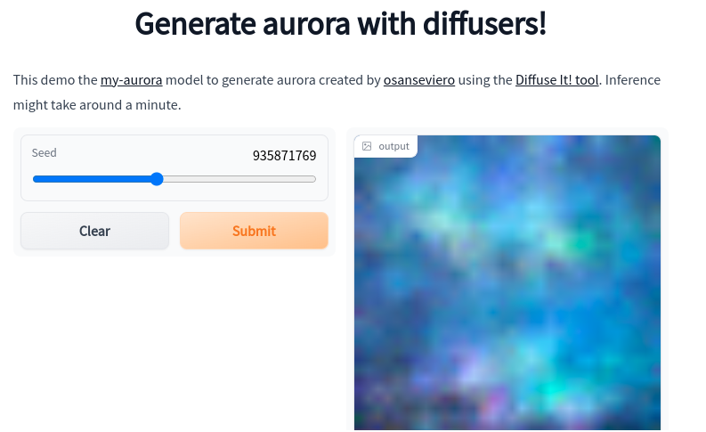
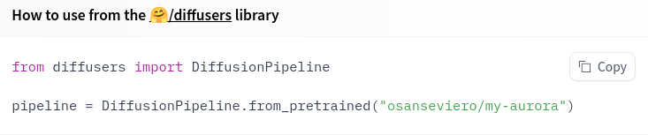

# Diffuse it! 🧨

Create your ML models and demos for generating images for a word you specify in a couple of minutes! 

## Usage

Click on the link below to try it out:

## How does it work?

### 1. You define which term to use

### 2. We download ~150 images 

### 3. We train a Diffusion model using the `diffusers` library. 🍿

### 3. We push the model to Hugging Face Hub to share the model with the world

### 4. We create a demo so anyone can try it out, even if they don't know code!

### But if you do like to code, load the model with a single line of code!

